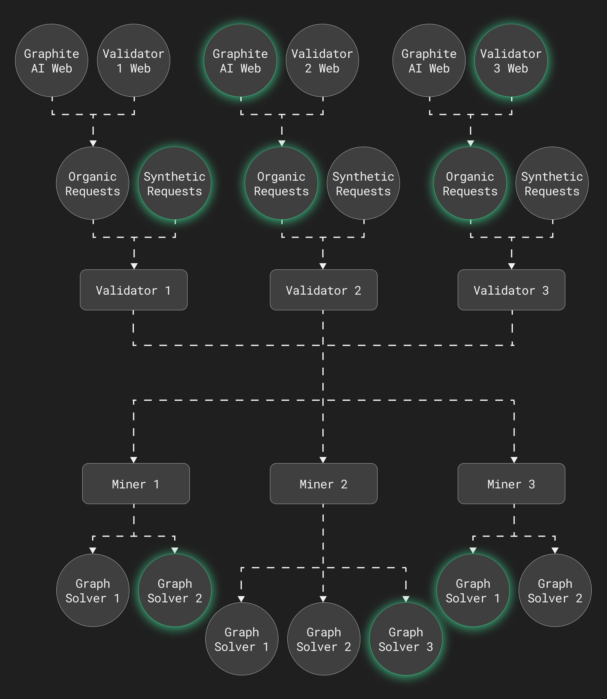

<h1 align="center">G R A P H I T E</h1>

<i>A decentralized network for solving graph optimization problems, built on Bittensor, the foremost decentralised AI network.</i>

<!-- 

 -->

Website: https://graphite-ai.net/
<!-- &nbsp;&nbsp;-->
&nbsp;&nbsp;
<!-- &nbsp;&nbsp; -->

> [!WARNING]  
> The Graphite AI team is still actively developing and updating on this subnet. There may potentially be breaking changes along the way, so please join our <a href="https://discord.gg/sN5NU32M">Discord</a> chat to stay up-to-date with the latest updates.
> If there are any bugs you have discovered or contribute to this subnet, please refer to 
    <a href="./CONTRIBUTING.md">Contribute</a> for a list of guidelines on how to contribute.

## Our Philosophy 💡

At Graphite AI, we believe in the power of accessibility, innovation and feedback. Our approach is rooted in these core principles:

### Accessibility 🌍

We prioritize making our solutions accessible to users of all skill levels. Our tools and documentation are designed to be intuitive and easy to navigate.
Our step-by-step guides and tutorials ensure that everyone can leverage our solutions effectively.
Our support team is dedicated to assisting you, regardless of your technical background, providing resources and help in multiple formats.

### Innovation 🚀

We constantly push the boundaries of technology to provide state-of-the-art solutions for graphical problems.
Our dedicated R&D team works tirelessly to explore new possibilities and integrate the latest advancements into our offerings.
We foster a culture of collaboration, both internally and with our user community, to drive innovation. Your ideas and feedback are integral to our development process.

### Communication 🗣️

We actively listen to our users and miners, incorporating your insights to continuously improve our solutions.
We gather your opinions through surveys, polls, community forums, and dedicated customer support.
Your feedback helps us enhance features, fix bugs, and improve user experience, ensuring both developers and non-developers can easily use our tools.

Together, these values form the foundation of Graphite AI, driving us to deliver exceptional solutions while fostering an inclusive and innovative community.

We thank you for your support and look forward to continuing this journey with you. :open_hands:

# Subnet Information :information_source:

    
<h2>Table of Contents 📚</h2>

    <ol style="list-style: none;">
        <li>
            <a href="#about" style="color: #3ecf8e;">About 🌐</a>
            <ul style="list-style: none; margin-left: 2px;">
                <li>
                    → <a href="#what-is-graphite" style="color: #edb334;">What is Graphite? 🔍</a>
                </li>
                <li>
                    → <a href="#where-does-bittensor-fit-in" style="color: #edb334;">Where does Bittensor fit in? 🧩</a>
                </li>
                <li>
                    → <a href="#how-does-this-subnet-work" style="color: #edb334;">How does this subnet work? 🤔</a>
                </li>
                <li>
                    → <a href="#future-development" style="color: #edb334;">Future Development 🔮</a>
                </li>
            </ul>
        </li>
        <li>
            <a href="#features" style="color: #3ecf8e;">Features ✨</a>
            <ul style="list-style: none; margin-left: 2px">
                <li>
                    → <a href="#versatile-input-methods" style="color: #edb334;">Versatile Input Methods ⌨️</a>
                </li>
                <li>
                    → <a href="#algorithm-support" style="color: #edb334;">Algorithm Support ⚙️</a>
                </li>
            </ul>
        </li>
        <li><a href="#reward-mechanism" style="color: #3ecf8e;">Reward Mechanism 💰</a></li>
        <li><a href="#installation" style="color: #3ecf8e;">Installation 🛠️</a></li>
        <li><a href="#contribute" style="color: #3ecf8e;">Contribute 🤝</a></li>
        <li><a href="#license" style="color: #3ecf8e;">License 📜</a></li>
        <li><a href="#contact" style="color: #3ecf8e;">Contact 📞</a></li>
    </ol>

## About 🌐

### What is Graphite? 🔍

Graphite is a specialized subnet designed to handle graphical problems efficiently.    
Graphite focuses on the <a href="https://trackobit.com/blog/what-is-a-traveling-salesman-problem-explained">Traveling Salesman Problem</a> (TSP), a classic optimization problem that involves finding the shortest possible route that visits a set of cities and returns to the starting point. This problem is a fundamental challenge in the fields of computer science, mathematics, and operations research as its complexity grows exponentially with the number of cities.

### Where does Bittensor fit in? 🧩

Bittensor plays a crucial role in enhancing the capabilities of Graphite. Graphite leverages Bittensor's decentralized machine learning network to efficiently connect miners to handle the computational demands of the TSP and similar graphical problems. This collaboration enables Graphite to provide a robust and scalable infrastructure for solving complex optimization problems.

### How does this subnet work? 🤔

Graphite operates as a decentralized network that connects miners and validators to solve graph optimization problems. Currently, synthetic requests are being generated by the validators and sent to miners in the network. Miners are responsible for solving the TSP using the algorithms they have devised and be sent back to the validators to be evaluated.

### Future Development 🔮

We aim to have our own frontend interface where users can input their graph problems and receive solutions from the miners. This will provide a seamless experience for end users to interact with the Graphite subnet and leverage its capabilities to solve complex optimization problems.

## Features ✨

### Versatile Input Methods ⌨️

We support both coordinate inputs for undirected graphs and edge inputs for directed graphs. This flexibility allows our users to represent their graphical problems in the most intuitive and effective way for their specific use case.

### Algorithm Support ⚙️

Instead of our throwing miners to fend for themselves, we provide four different algorithms to assist them in solving the TSP. We have implemented these algorithms for you so it will not be too daunting to begin mining on Graphite.

<table>
    <tr>
        <th>Algorithm</th>
        <th>Description</th>
    </tr>
    <tr>
        <td>Nearest Neighbour</td>
        <td>A simple and efficient heuristic that builds a tour by repeatedly visiting the nearest unvisited city.</td>
    </tr>
    <tr>
        <td>Dynamic Programming</td>
        <td>An exact method that solves the problem optimally by breaking it down into smaller subproblems.</td>
    </tr>
    <tr>
        <td>Beam Search</td>
        <td>A heuristic search algorithm that explores a graph by expanding the most promising nodes.</td>
    </tr>
    <tr>
        <td>Hybrid Pointer Network</td>
        <td>An advanced deep learning-based approach that combines the strengths of neural networks and traditional optimization techniques.</td>
    </tr>
</table>

With that said, to the experienced developers and miners, we encourage you to provide your own algorithms and solvers to improve the performance of the subnet. We have a reward mechanism that incentivizes miners to develop high-performance solvers that outperform the existing algorithms. Read more at [Reward Mechanism](#reward-mechanism).

## Reward Mechanism 💰

We rewards miners based on their ability to solve graph optimization problems effectively. Miners are incentivized to produce high-quality solutions within a specified timeframe. The rewards are distributed based on the performance of the submitted solutions relative to the best solution in the cohort and a benchmark solution (greedy heuristic). Validators further evaluate the solutions and penalize those that fall short of the performance benchmark.

## Installation 🛠️

Here at Graphite, we aim to make the installation process as seamless as possible, regardless of your technical knowledge. To get you started, we have crafted step-by-step guides and tutorials:

- Basic Installation Guide: [Installation Guide](./docs/installation.md)
- For Miners: [Miner Installation Guide](./docs/miner.md)
- For Validators: [Validator Installation Guide](./docs/validator.md)

## Contribute 🤝

Refer to our [Contribution Guidelines](./CONTRIBUTING.md) for detailed instructions on how to contribute to the Graphite AI subnet. We welcome contributions from developers, miners, validators, and users who are passionate about graph optimization problems and decentralized networks.

## License 📜

Graphite is licensed under the [MIT License](./LICENSE.md). Feel free to use, modify, and distribute our codebase for your projects. We appreciate any feedback, suggestions, and contributions to help us improve our solutions and make them more accessible to the community.

<pre align="center">
      ___          ___          ___          ___       ___                              ___
     /  /\        /  /\        /  /\        /  /\     /__/\       ___          ___     /  /\
    /  /:/_      /  /::\      /  /::\      /  /::\    \  \:\     /  /\        /  /\   /  /:/_
   /  /:/ /\    /  /:/\:\    /  /:/\:\    /  /:/\:\    \__\:\   /  /:/       /  /:/  /  /:/ /\
  /  /:/_/::\  /  /:/~/:/   /  /:/~/::\  /  /:/~/:/___ /  /::\ /__/::\      /  /:/  /  /:/ /:/_
 /__/:/__\/\:\/__/:/ /:/___/__/:/ /:/\:\/__/:/ /://__/\  /:/\:\\__\/\:\__  /  /::\ /__/:/ /:/ /\
 \  \:\ /~~/:/\  \:\/:::::/\  \:\/:/__\/\  \:\/:/ \  \:\/:/__\/   \  \:\/\/__/:/\:\\  \:\/:/ /:/
  \  \:\  /:/  \  \::/~~~~  \  \::/      \  \::/   \  \::/         \__\::/\__\/  \:\\  \::/ /:/
   \  \:\/:/    \  \:\       \  \:\       \  \:\    \  \:\         /__/:/      \  \:\\  \:\/:/
    \  \::/      \  \:\       \  \:\       \  \:\    \  \:\        \__\/        \__\/ \  \::/
     \__\/        \__\/        \__\/        \__\/     \__\/                            \__\/
</pre>

[Back to Top](#top)
