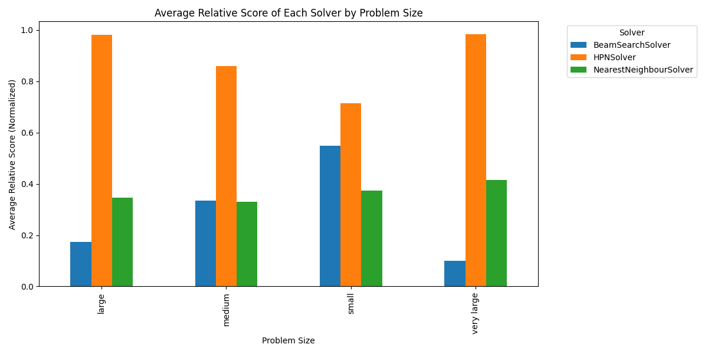

> [!WARNING]  
> This document assumes you have gone through the proper basic installation steps. If you haven't, please refer to the [installation guide](./installation.md) before proceeding.

# Miner Setup 📜

Welcome to the Miner Guide! 🎉

This guide will teach you how to run your miner on the Graphite subnet. It goes over the setup steps for your miner to solve graph optimization problems and submit solutions to the subnet.

<hr>

## Table of Contents 📑
<!-- 
1. [Setup](#setup) 📋
    1. [Clone the repository](#clone-the-repository) 📂
    2. [Install the python dependencies](#install-the-python-dependencies) 🐍 -->
1. [Running a Miner](#running-a-miner) 🏃
2. [Succeeding as a Miner](#succeeding-as-a-miner) 🏆
    1. [Provided Solvers](#provided-solvers) 🧠
    2. [Improving the Stock Miner Code](#improving-the-stock-miner-code) 🛠️
3. [Useful Tips](#useful-tips) ✍
    1. [External Resources](#external-resources) 📚
    2. [Testing Suite](#testing-suite) 🧪

<!-- <a id="setup"></a>

## Setup 📋 -->

> [!IMPORTANT]
We have a set of minimum hardware requirements for running a validator. See [min_compute.yml](../min_compute.yml).

_Compute requirements were estimated based on conservative projections of network traffic. Better/More computationally intensive algorithms are likely to benefit from faster compute._

<!-- <a id="clone-the-repository"></a>

### Clone the repository 📂
```bash
git clone #TODO replace with the actual repository link
cd graphite-ai-subnet
```

<a id="install-the-python-dependencies"></a>

### Install the python dependencies 🐍
Optional: Install the python dependencies in a virtual environment by running
```bash
python3 -m venv <your_environment_name>
```
Ensure you have an appropriate python version using (version >= 3.10)
```bash
python --version
```
Install the necessary libraries. Refer to requirements.txt for the list of required packages.
```bash
pip install --upgrade pip
pip install -e .
``` -->

<hr>

<a id="running-a-miner"></a>

## Running a Miner 🏃
To run a miner on the Graphite-AI subnet, miners will need to run the miner neuron. This neuron listens for incoming requests from validators and rewards are then given based on successful reponses to those requests.

```bash
python3 -m neurons.miner --netuid NETUID --subtensor.network NETWORK --wallet.name NAME --wallet.hotkey HOTKEY --logging.debug info --axon.port PORT --blacklist.force_validator_permit True
```
If you are running on a remote server, ensure that your internal and external ports are correct. If they differ, please add the --axon.external_port <EXTERNAL_PORT> flag.

using pm2:
```bash
pm2 start neurons/miner.py --name graphite_miner --interpreter python -- --netuid NETUID --subtensor.network NETWORK --wallet.name NAME --wallet.hotkey HOTKEY --logging.debug info --axon.port PORT --blacklist.force_validator_permit True
```

For more detailed instructions on creating a wallet and registering onto a subnet, refer to our [installation guide](./installation.md).

<hr>

<a id="succeeding-as-a-miner"></a>

## Succeeding as a Miner 🏆

Miners on the Graphite-AI subnet are tasked to solve graph optimization problems which have a myriad of real-world applications (refer to [subnet_overview.md](./subnet_overview.md) for more information.) Miners are rewarded based on their ability to produce good solutions within a given timeframe (default as 20 seconds).

We currently pose 2 types of graph problems: the Metric Travelling Salesman Problem (TSP) and the General TSP. Various approaches to the problems have been researched. 

To perform well as a miner, you need to:
- Innovate more effective heuristics for solving large TSP problems 
- Implement existing algorithms in a computationally efficient manner
- Select the best approaches for solving each variant of the TSP across various graph sizes

<a id="provided-solvers"></a>

### Provided Solvers 🧠

`Greedy Solver`:
This solver works by selecting the nearest neighbour as the next node to visit. The output path is rarely optimal but it is the simplest and fastest heuristic at $O(n^2)$ time complexity and $O(n)$ space complexity.

This is the default benchmark used by validators to determine the quality of your solution. As such, if you fail to beat this benchmark, your score will be penalized.

`Beam Search Solver`:
Beam search tracks the best n paths as it builds towards a complete path back to the origin node. Updating the beam width, $w$, can increase the likelihood of finding a better path but also increases the time and space complexity, $O(w \cdot n^2)$ and $O(w \cdot n)$ respectively.

`Dynamic Programming Solver`:
Dynamic programming is an approach that guarantees solution optimality. Through memoization, the time complexity is reduced from $O(n!)$ to $O(n^2 \cdot 2^n)$. However, this is still very computationally expensive where problems above 20 nodes take a significant amount of time to solve.

`Hybrid Pointer Network`:
Pointer networks are the most advanced AI approach for solving large TSP problems. It uses its attention mechanism to output a sequence of pointers.

Credits to [AhmedStohy](https://github.com/AhmedStohy/Hybrid-Pointer-Networks) for the source code for model training.

<a id="improving-the-stock-miner-code"></a>

### Improving the Stock Miner Code 🛠️
Changes to the miner code can be made by changing the way that problems are assigned to different solvers. The solvers are implemented as classes that are instantiated along with the Miner. Simply edit the import statements and change the instantiated solver to your desired solver class.

A basic implementation is provided in the miner code. 

```python
# Conditional assignment of problems to each solver
if synapse.problem.n_nodes < 15:
    # Solves the problem to optimality but is very computationally intensive
    route = await self.solvers['small'].solve_problem(synapse.problem)
else:
    # Simple heuristic that does not guarantee optimality. 
    route = await self.solvers['large'].solve_problem(synapse.problem)
```

In the solvers module [graphite-ai/solvers], we provided 4 solvers: Greedy/NearestNeighbour, Beam Search, Dynamic Programming (DP), and Hybrid Pointer Network (HPN).

Rewards to miners are assigned based on their relative performance to the best answer of the cohort of solutions submitted by all the miners in the subnet. A performance filter is further applied by the validators that penalize answers that fall short of the performance benchmark which is set by the greedy solver.

As such, miners are encouraged to explore the various solvers and develop their own high-performance solvers that achieve state-of-the-art performance.

<hr>

<a id="useful-tips"></a>

## Useful Tips ✍

<a id="external-resources"></a>

### External Resources 📚

> [!NOTE]
> These links are not affiliated with Graphite AI and are provided to help you understand the problem space better.

[Introduction to TSP and existing algorithms](https://youtu.be/GiDsjIBOVoA?si=gJPiA0d9qT6SRvNU)

[Alternative Introduction](https://trackobit.com/blog/what-is-a-traveling-salesman-problem-explained)

[TSP Variants](https://www.comp.nus.edu.sg/~stevenha/cs4234/lectures/04.TSP.pdf)

[Pointer Networks and State-of-the-Art](https://arxiv.org/pdf/2103.03012)

<a id="testing-suite"></a>

### Testing Suite 🧪
As more miners compete on the subnet, miners will have to develop custom solvers by training better models or developing better algorithms. To aid in testing, we have also provided boilerplate code for evaluating the performance of your custom solver with the other stock solvers.

Edit the import statement and run the python file to get comparative metrics of the various solvers. You can also wrap the problem-to-solver assignment logic within a custom solver to compare various assignment strategies.

```python
from graphite_ai.solvers import *
.
.
.
test_solvers = [NearestNeighbourSolver(), BeamSearchSolver(), HPNSolver()] # add more solver instances
```
and run:
```bash
python tests/evaluate_solvers.py
```
You can expect such an output:
```bash
Running Solver 1 - NearestNeighbourSolver
NearestNeighbourSolver solving {'Metric TSP'}: 100%|█████████████████████████████████████████████████████████████████████████████████| 1000/1000 [00:00<00:00, 2639.82it/s]
Running Solver 2 - BeamSearchSolver
BeamSearchSolver solving {'Metric TSP'}: 100%|████████████████████████████████████████████████████████████████████████████████████████| 1000/1000 [00:07<00:00, 134.16it/s]
Running Solver 3 - HPNSolver
HPNSolver solving {'Metric TSP'}: 100%|████████████████████████████████████████████████████████████████████████████████████████████████| 1000/1000 [00:54<00:00, 18.35it/s]
```
to get:

<div style="display:flex; justify-content:center;">

</div>

`Generating Datasets`: You can also use the dataset module to generate training data for more advanced pointer networks. Note that pointer networks are currently configured for coordinate data (MetricTSP).
