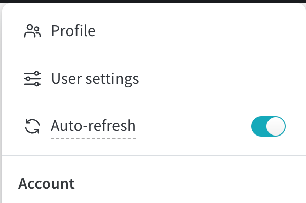
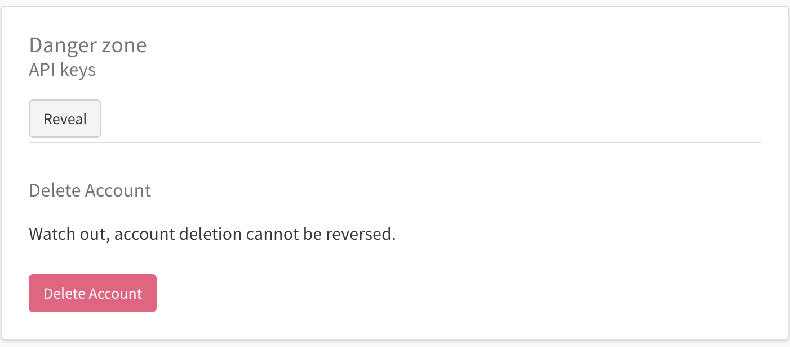

> [!WARNING]
> This document assumes you have gone through the proper basic installation steps. If you haven't, please refer to the [installation guide](./installation.md) before proceeding.

# Validator Guide 📜

Welcome to the Validator Guide! 🎉

This guide will teach you how to run your validator smoothly. It goes over the set-up steps for your validator for the Graphite subnet.

<hr>

## Table of Contents 📑

1. [Setup](#setup)
2. [Running a Synthetic Validator](#running-a-synthetic-validator)
3. [Running an Organic Validator](#running-an-organic-validator)

<hr>

<a id="setup"></a>

## Setup

> [!IMPORTANT]
We have a set of minimum hardware requirements for running a validator. See [min_compute.yml](../min_compute.yml).

_Compute requirements were estimated based on conservative projections of network traffic. Better/More computationally intensive algorithms are likely to benefit from faster compute._

1. Head to Weights and Biases and create an account. You can sign up [here](https://wandb.ai/site).

2. Head to the `User Settings` page. <br>
<p align="center">
  
</p>

3. Scroll down to `Danger Zone`. <br>
<p align="center">
  
</p>

4. Click on `Reveal` and copy the API key.

5. Create a `.env` file in the root directory of the project and add the following:
```bash
WANDB_API_KEY=YOUR_API_KEY
```

<hr>

> [!TIP]
> Rather than connecting to the `finney` endpoint, it is recommended that you run a [local subtensor](https://github.com/opentensor/subtensor/blob/main/docs/running-subtensor-locally.md).

<a id="synthetic-vali"></a>

## Running a Synthetic Validator 
Synthetic validators generate randomly generated graph problems by using a binned distribution to select the size of the problem (number of nodes), followed by sampling from a uniform distribution to populate either the coordinates or edges between the nodes. 

These problems are then sent to miners to challenge them. Running a synthetic validator is as simple as executing <ins>**one**</ins> of the following instructions:
<br>  

#### <ins>Running the Validator</ins>
```bash
python3 neurons/validator.py --netuid NETUID --subtensor.network NETWORK --wallet.name NAME --wallet.hotkey HOTKEY --logging.trace --axon.port PORT --organic False
```  

<br>

#### <ins>Running the Validator with auto-restart using PM2</ins>
Install **pm2** into your machine. Navigate to your Graphite-Subnet repo and verify that you are in the right python environment.


For auto restart, please use **pm2** to run the validator with the following command:
```
pm2 start neurons/validator.py --name auto_update_graphite_validator --interpreter python3 -- --netuid NETUID --subtensor.network NETWORK --wallet.name NAME --wallet.hotkey HOTKEY --logging.trace --axon.port PORT --organic False
```


Verify that your validator is running correctly using `pm2 status`. You should see that `auto_update_graphite_validator` is running. Further inspect the process logs using `pm2 logs auto_update_graphite_validator`.

<br>

#### <ins>Running the Validator with auto-update</ins>
Note that you should <ins>**not**</ins> run this command along with the auto-restart command as it might cause unexpected behavior as they both initialize pm2 processes of the same name. Install **pm2** and **jq** on your machine before running this code.


For auto update and auto restart, please run `run.sh` which runs a script that checks github for the current repository version every hour. If your local version differs, it pulls the new repository and installs it (The script is configured to run the pm2 process with the name: `auto_update_graphite_validator`):
```
source run.sh --netuid NETUID --subtensor.network NETWORK --wallet.name NAME --wallet.hotkey HOTKEY --logging.debug --axon.port PORT --organic False
```  
<br>  

_For the above commands, please replace:_ `NAME`, `NETWORK`, `HOTKEY`, `PORT` 
- Mainnet: `NETIUD 43`, `NETWORK finney or NETWORK <your_local_subtensor_endpoint>`
- Testnet: `NETUID 65`, `NETWORK test`

Edit the logging flag per your needs

<br>

<a id="organic-vali"></a>

## Running an Organic Validator 

> [!WARNING]
> Organic validators are currently in development and coming soon. Please stay tuned for updates.
